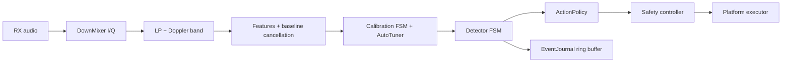

# Architecture (Phase 3 / v1.0.0)

- `core/` is dependency-free and owns DSP, calibration, detection, safety, and event journal.
- `audio/` provides fake + optional real backends.
- `platform/` executes `ActionRequest` (Linux command chain / Windows LockWorkStation).
- `app/` handles CLI, config loading, logging, lifecycle, and shutdown signals.

Filter choice remains first-order IIR for deterministic low-latency streaming with persistent state.
